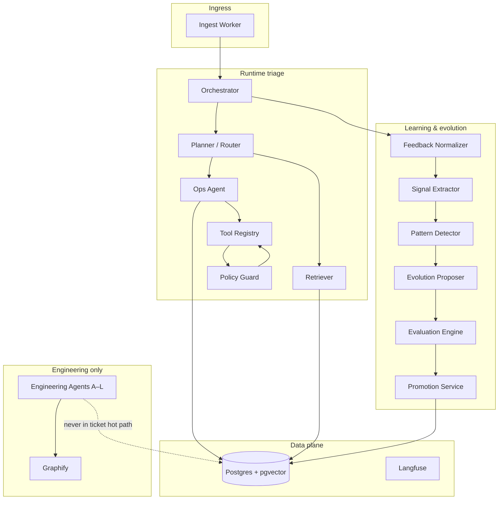
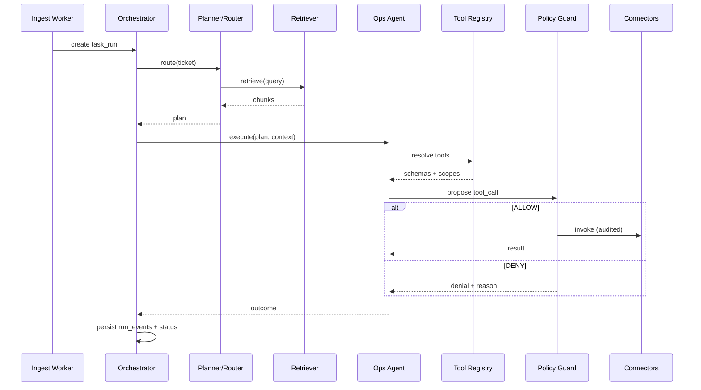

# EvoOps Agent Architecture

EvoOps separates **runtime agents** (production triage loop, evolution loop, ingestion) from **engineering agents A–L** (repo intelligence, scaffolding, eval assets). The platform defaults to **deterministic services** for routing, policy, scoring, and promotion; LLMs are reserved for ambiguous classification, synthesis, and proposal drafting where no stable rule exists yet.

**Tenancy:** single organization. **Demo vertical:** IT / internal ops triage. **Evolution mutates:** agent version **config only** (prompts, routing rules, tool policies, retrieval knobs)—never arbitrary application source in production paths.

---

## Design principles

| Principle | Implication |
|-----------|-------------|
| Deterministic first | Planner/Router, Policy Guard, Evaluation Engine, Promotion Service, and most ingest steps are code + SQL, not LLM. |
| Bounded LLM surfaces | Ops Agent and Evolution Proposer call models with fixed JSON schemas and post-validation. |
| Same authz everywhere | Runtime tool calls and MCP dev adapters share connector contracts, scopes, and audit fields. |
| Observable by default | Every agent step emits structured `run_events`; LLM spans go to Langfuse with correlation IDs. |
| Fail closed | Policy Guard and Promotion Service reject on ambiguity; humans approve config promotion. |

---

## System context



**Graphify** indexes repository and engineering context under `graphify-out/` for builders only. It is **not** invoked by Orchestrator, Retriever, or Ops Agent during ticket triage.

---

## Runtime vs engineering

| Class | Runs in | Trigger | Mutates production config? |
|-------|---------|---------|----------------------------|
| Runtime agents | API / worker processes | Tickets, schedules, eval jobs | Only via Promotion Service after eval + approval |
| Engineering agents A–L | CI, local dev, admin jobs | Repo changes, manual runs | Repo files, eval suites, connector stubs—not live `ACTIVE` agent version |
| Graphify pipeline | Offline indexer | Git push / scheduled reindex | `graphify-out/` artifacts only |

---

## Agent responsibility matrix

Columns **Type**: `deterministic` | `LLM` | `orchestration` | `worker` | `eval`.

### Runtime agents

| Agent | Responsibility | Inputs | Outputs | Tools | Database Access | Risk | Type |
|-------|----------------|--------|---------|-------|-----------------|------|------|
| **Orchestrator** | Owns end-to-end `task_run` lifecycle: start, step ordering, timeouts, compensation hooks, final status. | `task_id`, org context, trigger payload, active `agent_version_id` | `task_run` row, `run_events`, terminal status (`SUCCEEDED` / `FAILED` / `ESCALATED`) | Internal step scheduler, Langfuse trace root | R/W: `tasks`, `task_runs`, `run_events`; R: `agent_versions`, `agent_version_config` | Stuck runs, duplicate side effects if retries misconfigured | orchestration |
| **Planner / Router** | Deterministic intent → queue, playbook, tool plan, and escalation path from config + parsed ticket features. | Normalized ticket fields, severity hints, routing config, optional classifier output | `routing_decision` (JSON), next step list, `escalate` flag | Rule engine, feature extractors (regex/lookup), optional LLM classifier adapter (bounded) | R: `agent_version_config.routing`, `semantic_chunks`, `procedural_memory`; R/W: `run_events` | Wrong queue / wrong tool plan → bad automation | deterministic |
| **Ops Agent** | Executes the plan: synthesize operator-facing summary, choose among **allowed** tools, format tool arguments, interpret tool results. | `routing_decision`, retrieved chunks, ticket thread, tool catalog slice | Assistant messages, `tool_call` requests (pending Policy Guard), proposed human actions | LLM (structured output), Tool Registry client | R/W: `run_events`, `tool_calls`; R: episodic/semantic context | Tool misuse, prompt injection leading to exfiltration attempts | LLM |
| **Retriever** | Hybrid retrieval over ops knowledge: filters, pgvector similarity, recency, feedback-weighted boosts. | Query text, `instrumentation_tags`, retrieval config from active version | Ranked `chunk_ids`, citations, retrieval debug blob | pgvector SQL, keyword fallback | R: `semantic_chunks`, `episodic_memory`, `feedback` aggregates; W: optional retrieval metrics | Wrong runbook → incorrect resolution | deterministic |
| **Tool Registry** | Canonical catalog of connectors/actions: JSON Schema for args, scope requirements, rate limits, idempotency keys. | Connector manifests (versioned), org enablement flags | Resolved tool metadata for Policy Guard + Ops Agent | Static registry loader, health checks | R: `connectors`, `connector_actions`, `org_connector_settings`; W: none at runtime | Stale schema → validation bypass if not enforced downstream | deterministic |
| **Policy Guard** | Pre-flight and post-flight enforcement: RBAC, scope, injection heuristics, approval requirements, rate limits. | Proposed `tool_call`, user/task context, policy bundle from active version | `ALLOW` / `DENY` / `REQUIRE_APPROVAL`, audit record | Rule engine, allowlist matchers | R/W: `tool_calls` (status), `audit_log`, `approval_requests` | **Critical:** blocked attack surface if skipped | deterministic |
| **Feedback Normalizer** | Maps UI/API feedback (thumbs, corrections, tags) into canonical feedback records linked to runs. | Raw feedback payload, `task_run_id`, operator id | `feedback` rows, normalized labels | Validation schemas | R/W: `feedback`; R: `task_runs` | Poisoned labels if auth missing | worker |
| **Signal Extractor** | Turns runs + feedback into atomic signals (metric events) for pattern mining. | `task_run`, `tool_calls`, `feedback`, config thresholds | `signals` rows | SQL aggregations, optional LLM summarizer (off by default) | R/W: `signals`; R: runs, feedback | Noise → bad evolution proposals | deterministic |
| **Pattern Detector** | Detects recurring failure/success motifs over sliding windows (deterministic stats + rules). | `signals`, time window, min support | `patterns` rows, confidence, exemplar run ids | Windowed SQL, rule templates | R/W: `patterns`; R: `signals` | False patterns → wasted eval cycles | deterministic |
| **Evolution Proposer** | Drafts **candidate agent version config** diffs from patterns (prompt, routing, tool policy, retrieval only). | `patterns`, current `ACTIVE` config, proposal templates | `evolution_proposals`, new `agent_versions` (`DRAFT`) | LLM (diff in schema), deterministic merge validator | R/W: `evolution_proposals`, `agent_versions`, `agent_version_config`; R: patterns | Unsafe config suggestions → blocked by schema + eval | LLM |
| **Evaluation Engine** | Runs weighted scorecard suites against a draft version; applies regression gates. | `agent_version_id`, `eval_suite_id`, fixture tasks | `eval_runs`, `eval_results`, pass/fail gate outcome | Task simulator, deterministic graders, optional LLM judge (scoped) | R/W: eval tables; R: tasks/fixtures | False promote if gates weak | eval |
| **Promotion Service** | State machine: `DRAFT` → `EVALUATING` → `PENDING_APPROVAL` → `ACTIVE`; rollback pointer. | Eval pass token, approval record, admin action | Updated version status, audit, cache bust for config | Transactional SQL, event bus | R/W: `agent_versions`, `approvals`, `audit_log` | **Critical:** unauthorized promotion | deterministic |
| **Ingest Worker** | Pulls or accepts tickets/alerts, dedupes, normalizes, enqueues Orchestrator jobs. | Webhook/email/mock IT feed, ingest config | `tasks`, enqueue message | Connectors (mock IT job MVP), Resend inbound (future) | R/W: `tasks`, ingest cursors; W: `run_events` | Duplicate storms, PII in wrong table | worker |

### Engineering-only (Graphify + agents A–L)

| Agent | Responsibility | Inputs | Outputs | Tools | Database Access | Risk | Type |
|-------|----------------|--------|---------|-------|-----------------|------|------|
| **Graphify Indexer** | Builds code graph / summaries into `graphify-out/` for engineering queries. | Git tree, build config | Graph artifacts, manifest | Graphify CLI | None on ops DB; filesystem only | Leaked secrets in graph if scanner skipped | worker |
| **A — Repo Cartographer** | Maps monorepo layout, ownership, service boundaries for docs and scaffolding. | Repo files, Graphify manifest | `docs/CODEMAP.md` updates, service graph | Graphify read, static analysis | None | Low | deterministic |
| **B — Schema Steward** | Proposes Supabase migrations from data model doc; validates RLS patterns. | `DATA_MODEL.md`, existing migrations | Migration SQL drafts | SQL parser, policy templates | Dev DB only | Bad RLS in draft migrations | deterministic |
| **C — API Contract Smith** | Keeps OpenAPI / Pydantic models aligned with PRODUCT_SPEC endpoints. | Architecture docs, route list | OpenAPI, shared types | Codegen | None | Contract drift | deterministic |
| **D — Unit Test Fabricator** | Generates unit tests for deterministic agents (Policy Guard, Router, Promotion). | Module under test, golden IO | `tests/unit/*` | pytest templates | None | Low | deterministic |
| **E — Eval Scenario Author** | Authors eval suite cases (fixtures, expected tools, regression tags). | Demo flows, incident postmortems | `eval_suites`, fixture JSON | Eval schema validator | R/W: eval tables in staging | Bad golden data → false confidence | worker |
| **F — Connector Scaffold** | Generates typed Python adapter + MCP dev wrapper from connector manifest. | Manifest YAML | `adapters/*`, `mcp/*` stubs | Templates | None | Scope mistakes in generated code | deterministic |
| **G — Prompt Template Curator** | Maintains versioned prompt fragments referenced by config (not inline secrets). | Product tone, safety rules | Prompt library files | Lint for injection patterns | R: staging config | Prompt injection templates | LLM |
| **H — Policy Rule Author** | Edits machine-readable policy bundles (YAML/JSON) for Policy Guard. | SECURITY_ARCHITECTURE matrix | Policy files | Rule validator | None | Over-permissive rules | deterministic |
| **I — Docs Synchronizer** | Keeps architecture docs aligned with implemented agent names and tables. | Code + migrations | Doc PRs | Diff tools | None | Doc drift | orchestration |
| **J — Migration Verifier** | Runs migration dry-run, RLS probes, pgvector index checks in CI. | Migrations | CI report | Supabase CLI | CI test project | Missed RLS bug | eval |
| **K — Release Train** | Tags agent version bundles with app deploys; no auto-promote without human. | Git tag, changelog | Release notes | CI | R: `agent_versions` | Wrong pairing of app vs config | orchestration |
| **L — Secret & Scope Linter** | Scans repo and configs for keys, broad tool scopes, missing audit fields. | Repo, env samples | SARIF / CI fail | Gitleaks, custom rules | None | Missed leaked key | deterministic |

---

## Runtime control flow (ticket triage)



**Retry policy:** Orchestrator may retry **deterministic** steps (Retriever, Registry read). **Tool execution** follows connector idempotency keys; Policy Guard must re-approve each attempt. Ops Agent does not auto-retry denied tool calls.

---

## Configuration binding

Every runtime agent reads from **`agent_versions`** where `status = ACTIVE` unless explicitly pinned (eval replay uses `agent_version_id` on the eval run).

Config document shape (stored as JSONB, validated at write time):

```json
{
  "prompts": { "ops_system": "...", "summarize_ticket": "..." },
  "routing": { "rules": [], "default_queue": "general" },
  "tool_policy": { "allow": [], "deny": [], "require_approval": [] },
  "retrieval": { "top_k": 8, "min_score": 0.72, "boost_recent_days": 14 },
  "classifier": { "mode": "rules", "llm_fallback": false }
}
```

Evolution Proposer may only emit patches touching keys under this schema. Promotion Service rejects unknown keys.

---

## Inter-agent contracts

### Orchestrator ↔ Planner/Router

- **Input:** `NormalizedTicket`, `AgentVersionConfig.routing`, optional `classification` from ingest.
- **Output:** `RoutingDecision` with stable enum fields (`queue`, `severity`, `playbook_id`, `steps[]`).
- **SLA:** P95 &lt; 50 ms excluding optional LLM classifier.

### Ops Agent ↔ Tool Registry ↔ Policy Guard

- Ops Agent never sees raw connector credentials—only action ids and argument schemas.
- Policy Guard evaluates `(operator_role, task_labels, action_id, args_hash)` against `tool_policy`.
- Outputs are persisted before any network I/O to connectors.

### Learning pipeline ↔ Evolution

- Signal Extractor runs async (queue) after terminal run status.
- Pattern Detector runs on schedule (e.g. hourly) or when signal volume threshold met.
- Evolution Proposer runs only when pattern has `status = CONFIRMED` and no open draft for same facet.

---

## Deployment mapping

| Agent | Process | Scale notes |
|-------|---------|-------------|
| Orchestrator, Planner, Ops, Retriever, Policy Guard | `apps/api` FastAPI workers | Scale with request concurrency; keep Planner colocated |
| Ingest Worker | Background worker / cron | Single leader with advisory lock |
| Signal/Pattern/Evolution | Job queue consumer | Bursty; rate-limit LLM proposer |
| Evaluation Engine | Dedicated worker pool | CPU + LLM judge quota isolated from triage |
| Promotion Service | API + transactional Postgres | Minimal replicas; strong consistency |
| Engineering A–L | CI workflows, local CLI | No production runtime dependency |

---

## Observability

| Field | Where |
|-------|-------|
| `task_run_id`, `agent_version_id` | All logs and Langfuse traces |
| `run_event.type` | Step boundaries (`routing`, `retrieval`, `tool_proposed`, `tool_executed`, `policy_denied`) |
| `tool_call.policy_decision` | Audit + Langfuse span attribute |

Alerts (demo): spike in `policy_denied`, eval regression fail, promotion without approval id.

---

## Non-goals (agent layer)

- Autonomous editing of `apps/api` or `apps/web` source in response to tickets.
- Multi-tenant org isolation (single org; still use RLS for role separation).
- Graphify-backed retrieval during customer ticket handling.
- LLM-driven changes to Tool Registry scopes or Supabase RLS policies.

---

## Related documents

- [MCP Architecture](MCP_ARCHITECTURE.md) — connector abstraction and dev MCP adapters
- [Memory Architecture](MEMORY_ARCHITECTURE.md) — episodic/semantic/feedback/procedural stores
- [Evolution Engine](EVOLUTION_ENGINE.md) — proposal and promotion pipeline
- [Evaluation System](EVALUATION_SYSTEM.md) — scorecards and gates
- [Security Architecture](SECURITY_ARCHITECTURE.md) — authz matrix and approval gates
