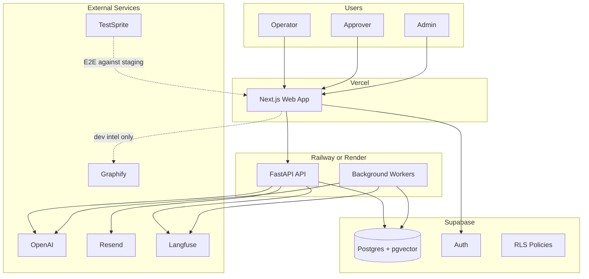
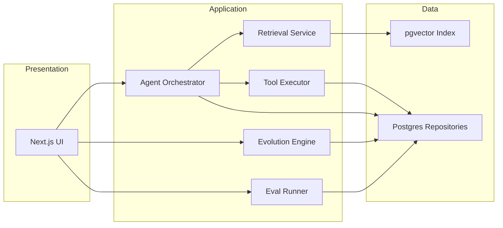
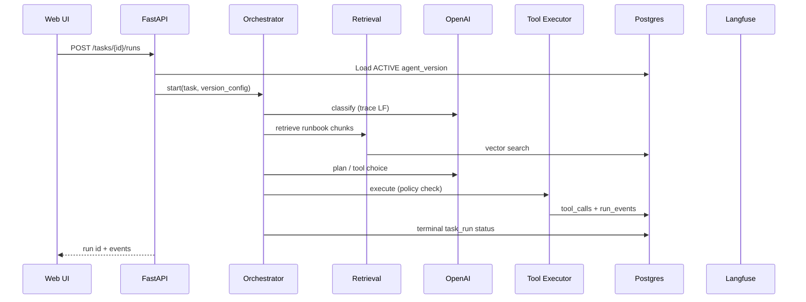
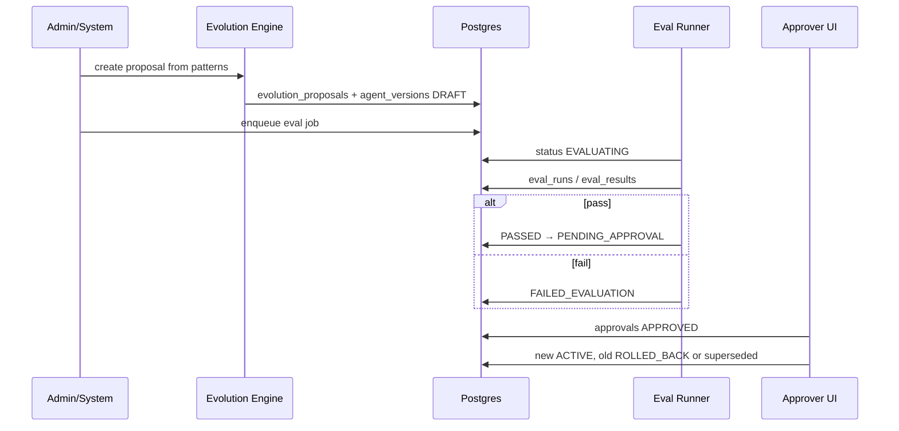

# EvoOps — System Architecture

**Version:** 0.1 (planning)  
**Audience:** Engineers implementing Phase 0+; stakeholders needing a deployment mental model

---

## 1. Architectural principles

1. **Config evolution, not code evolution** — Runtime behavior changes flow through `agent_versions` and related policy rows. Application repos deploy on normal CI/CD, decoupled from agent promotion.
2. **Single org, strong RLS** — One Supabase project; roles (`operator`, `approver`, `admin`) map to JWT claims and policies.
3. **Sync for interactive, async for heavy** — Task run **orchestration** may start synchronously from the UI; embeddings, eval batches, and notifications run as **jobs**.
4. **Audit everything that matters** — Version promotion, tool denial, connector changes, and break-glass actions append to `audit_log`.
5. **Observe LLM work in Langfuse** — Every model call tagged with `task_run_id`, `agent_version_id`, and trace id for support.

---

## 2. System context

**Graphify** does not sit on the hot path for ticket triage RAG. Developers may use it to explore the EvoOps codebase and dependencies; ops knowledge lives in Supabase pgvector.

---

## 3. Component breakdown

| Component | Responsibility | Runs on |
|-----------|----------------|---------|
| **Web app** (`apps/web`) | Auth session (Supabase client), task inbox, run timeline, feedback, approval UI, admin screens | Vercel (Node/Edge as configured) |
| **API** (`apps/api`) | REST/WebSocket for tasks, agents, knowledge ingest triggers, evolution apply, job enqueue, Langfuse hooks | Railway/Render |
| **Workers** (same repo, separate process) | Job consumers: chunk+embed documents, run eval suites, retry notifications, long task runs | Railway/Render |
| **Supabase** | Canonical data, vectors, auth users, RLS | Supabase Cloud |
| **OpenAI** | Chat/completions for agent steps; embeddings for `knowledge_chunks` | API |
| **Resend** | Transactional email for notify step | API |
| **Langfuse** | Trace storage and dashboards | Hosted |
| **TestSprite** | Automated browser E2E | CI / external runner |

---

## 4. Logical layers

- **Agent Orchestrator** — Loads **active** `agent_version` config, runs classify → retrieve → plan → tool loop until terminal state.
- **Retrieval Service** — Embeds query (or uses cached query vector), searches `knowledge_chunks`, returns citations to orchestrator.
- **Tool Executor** — Validates against `tool_policies`, resolves `connectors`, records `tool_calls`, returns structured results.
- **Evolution Engine** — Consumes `signals` / `patterns` / feedback aggregates; writes `evolution_proposals`; materializes DRAFT versions (human-triggered or scheduled job, product decision in Phase 8).
- **Eval Runner** — Executes `eval_cases` against a candidate version in isolated `task_runs`; updates version status.

---

## 5. Sync vs async flows

### 5.1 Synchronous (user waiting)

| Flow | Path | Notes |
|------|------|-------|
| Login | Web → Supabase Auth | JWT to API via Bearer |
| Start task run | Web → API → DB → Orchestrator (inline or quick poll) | May return `task_run_id` immediately and stream events |
| Submit feedback | Web → API → `feedback` insert | Triggers signal derivation async |
| Approve version | Web → API → transaction: `approvals`, deactivate old ACTIVE, set new ACTIVE | Must be atomic |

Target: API p95 &lt; 3s for non-tool-heavy steps; tool calls depend on third parties.

### 5.2 Asynchronous (job queue)

| Flow | Trigger | Worker action |
|------|---------|---------------|
| Document ingest | Admin upload | Parse, chunk, embed, write `knowledge_chunks`, update job status |
| Signal aggregation | Cron or post-run hook | Insert/update `signals`, detect `patterns` |
| Evolution proposal generation | Scheduled or admin | LLM-assisted diff → `evolution_proposals` + DRAFT version |
| Eval suite | Version → EVALUATING | Run all cases, aggregate `eval_results`, set PASSED or FAILED_EVALUATION |
| Email retry | Tool partial failure | Resend via job with backoff |

Jobs are rows in `jobs` (type, payload JSON, status, attempts). Workers use a service role Supabase client or direct Postgres pool with least privilege.

---

## 6. Agent execution sequence (runtime)

Human feedback arrives later and does not block run completion.

---

## 7. Evolution & promotion sequence

---

## 8. Deployment topology

| Environment | Web | API/Workers | DB | Purpose |
|-------------|-----|-------------|-----|---------|
| **Local** | `pnpm dev` | `uvicorn` + optional worker | Supabase local or dev project | Feature dev |
| **Staging** | Vercel preview | Railway/Render staging | Supabase staging | TestSprite, eval demos |
| **Production** | Vercel prod | Railway/Render prod | Supabase prod | Single-org live ops |

Environment variables (representative):

- Web: `NEXT_PUBLIC_SUPABASE_URL`, `NEXT_PUBLIC_SUPABASE_ANON_KEY`, `API_BASE_URL`
- API: `SUPABASE_SERVICE_ROLE_KEY` (workers only), `OPENAI_API_KEY`, `RESEND_API_KEY`, `LANGFUSE_*`, database URL if not via Supabase client
- Never expose service role to the browser.

---

## 9. API surface (planned)

Prefix: `/api/v1` (FastAPI). Auth: Supabase JWT; role checks in dependencies.

| Area | Examples |
|------|----------|
| Tasks | `GET/POST /tasks`, `POST /tasks/{id}/runs`, `GET /runs/{id}/events` |
| Agents | `GET /agents`, `GET /agents/{id}/versions`, `POST /versions/{id}/submit-eval` |
| Knowledge | `POST /knowledge/documents`, `GET /knowledge/search` |
| Evolution | `GET /evolution/proposals`, `POST /evolution/proposals/{id}/apply` |
| Approvals | `POST /versions/{id}/approve`, `POST /versions/{id}/reject` |
| Admin | `CRUD /connectors`, `CRUD /tool-policies`, `GET /audit-log` |

Exact routes are finalized in Phase 2–3; shapes align with [DATA_MODEL.md](DATA_MODEL.md).

---

## 10. Failure modes & resilience

| Failure | Behavior |
|---------|----------|
| OpenAI timeout | Run event error; task_run may retry if policy allows; no duplicate tool side-effects without idempotency keys |
| Tool denied by policy | Structured failure in `tool_calls`; operator sees reason |
| Eval failure | Version stays non-active; proposal may be revised |
| Worker crash | Job retries with max attempts; dead-letter status on `jobs` |
| DB unavailable | API 503; web degrades gracefully |

---

## 11. Testing strategy (architecture-level)

- **Unit** — Python domain logic (routing, policy checks, state machine) in `tests/unit`.
- **Integration** — API against local Supabase with migrations.
- **Eval** — Product-level regression via `eval_suites` (not replace unit tests).
- **E2E** — TestSprite against staging URL for login, task create, feedback, approval happy path.

---

## 12. Related documents

- [PRODUCT_SPEC.md](PRODUCT_SPEC.md) — Requirements and demo vertical  
- [DATA_MODEL.md](DATA_MODEL.md) — Tables and version state machine  
- [ROADMAP.md](ROADMAP.md) — Implementation phasing
