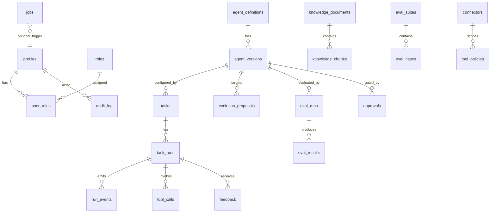
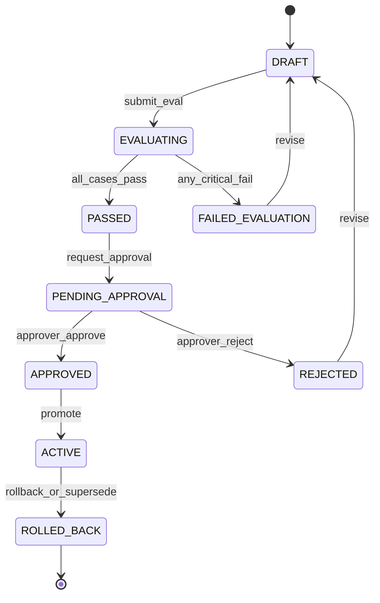

# EvoOps — Data Model

**Version:** 0.1 (planning)  
**Database:** Supabase Postgres with **pgvector**, **Auth**, and **RLS**

This document is the canonical reference for schema design before migrations land in `supabase/migrations/`. Types are indicative (Postgres); naming is snake_case.

---

## 1. Entity relationship overview

---

## 2. Identity & access

### `profiles`

Extends Supabase `auth.users`.

| Column | Type | Notes |
|--------|------|-------|
| `id` | uuid PK | FK → `auth.users.id` |
| `email` | text | Denormalized for admin lists |
| `display_name` | text | |
| `created_at` | timestamptz | |
| `updated_at` | timestamptz | |

### `roles`

Seed data: `operator`, `approver`, `admin`.

| Column | Type | Notes |
|--------|------|-------|
| `id` | uuid PK | |
| `key` | text UNIQUE | e.g. `operator` |
| `name` | text | Display |
| `description` | text | |

### `user_roles`

| Column | Type | Notes |
|--------|------|-------|
| `user_id` | uuid FK → profiles | |
| `role_id` | uuid FK → roles | |
| `granted_at` | timestamptz | |
| `granted_by` | uuid FK → profiles | nullable |
| PK | (user_id, role_id) | |

**RLS:** Users read self profile; admin manages roles. Operators cannot read service-only tables.

---

## 3. Agents & version state machine

### `agent_definitions`

Logical agent (e.g. `it-triage`).

| Column | Type | Notes |
|--------|------|-------|
| `id` | uuid PK | |
| `key` | text UNIQUE | Stable slug |
| `name` | text | |
| `description` | text | |
| `created_at` | timestamptz | |
| `archived_at` | timestamptz | nullable |

### `agent_versions`

Versioned **config only** (JSON documents).

| Column | Type | Notes |
|--------|------|-------|
| `id` | uuid PK | |
| `agent_definition_id` | uuid FK | |
| `version_number` | int | Monotonic per definition |
| `status` | text | See state machine below |
| `config` | jsonb | Prompts, routing, retrieval, tool policy refs |
| `config_hash` | text | For diff/display |
| `parent_version_id` | uuid FK | nullable; lineage from evolution |
| `evolution_proposal_id` | uuid FK | nullable |
| `created_by` | uuid FK → profiles | |
| `created_at` | timestamptz | |
| `activated_at` | timestamptz | nullable |
| `deactivated_at` | timestamptz | nullable |

**Constraint:** At most one row per `agent_definition_id` with `status = 'ACTIVE'`.

#### Status state machine

| Status | Meaning |
|--------|---------|
| `DRAFT` | Editable candidate, not used for production runs |
| `EVALUATING` | Eval worker running |
| `PASSED` | Eval succeeded; awaiting approval request |
| `PENDING_APPROVAL` | In approver queue |
| `APPROVED` | Approved; promotion transaction pending or completed |
| `ACTIVE` | Used for new `task_runs` |
| `FAILED_EVALUATION` | Blocked until revised |
| `REJECTED` | Human rejected; not promoted |
| `ROLLED_BACK` | Was active; superseded or manually rolled back |

---

## 4. Work execution

### `tasks`

Unit of ops work (ticket, alert, manual case).

| Column | Type | Notes |
|--------|------|-------|
| `id` | uuid PK | |
| `external_ref` | text | Ticket id from ITSM, nullable |
| `title` | text | |
| `body` | text | Raw description |
| `source` | text | `webhook`, `email`, `manual`, etc. |
| `priority` | text | nullable until classified |
| `category` | text | nullable until classified |
| `status` | text | `open`, `in_progress`, `resolved`, `failed` |
| `created_at` | timestamptz | |
| `updated_at` | timestamptz | |

### `task_runs`

Single agent execution against a task.

| Column | Type | Notes |
|--------|------|-------|
| `id` | uuid PK | |
| `task_id` | uuid FK | |
| `agent_version_id` | uuid FK | Snapshot of config used |
| `status` | text | `running`, `completed`, `failed`, `cancelled` |
| `langfuse_trace_id` | text | nullable |
| `started_at` | timestamptz | |
| `finished_at` | timestamptz | nullable |
| `error_summary` | text | nullable |

### `run_events`

Ordered timeline for UI and debugging.

| Column | Type | Notes |
|--------|------|-------|
| `id` | uuid PK | |
| `task_run_id` | uuid FK | |
| `sequence` | int | Order within run |
| `event_type` | text | `llm`, `retrieval`, `tool`, `decision`, `error` |
| `payload` | jsonb | Structured details |
| `created_at` | timestamptz | |

### `tool_calls`

| Column | Type | Notes |
|--------|------|-------|
| `id` | uuid PK | |
| `task_run_id` | uuid FK | |
| `connector_id` | uuid FK | |
| `tool_name` | text | |
| `request_payload` | jsonb | Redacted secrets |
| `response_payload` | jsonb | nullable |
| `status` | text | `success`, `denied`, `error` |
| `denial_reason` | text | nullable |
| `duration_ms` | int | nullable |
| `created_at` | timestamptz | |

---

## 5. Knowledge (ops RAG)

### `knowledge_documents`

| Column | Type | Notes |
|--------|------|-------|
| `id` | uuid PK | |
| `title` | text | |
| `source_uri` | text | nullable |
| `doc_type` | text | `runbook`, `policy`, `faq` |
| `tags` | text[] | |
| `status` | text | `processing`, `ready`, `archived` |
| `created_by` | uuid FK | |
| `created_at` | timestamptz | |

### `knowledge_chunks`

| Column | Type | Notes |
|--------|------|-------|
| `id` | uuid PK | |
| `document_id` | uuid FK | |
| `chunk_index` | int | |
| `content` | text | |
| `embedding` | vector(1536) | pgvector; dimension matches model |
| `metadata` | jsonb | Section headings, page |
| `created_at` | timestamptz | |

**Index:** IVFFlat or HNSW on `embedding` with appropriate ops (cosine/L2 per embedding model).

---

## 6. Feedback, signals, patterns

### `feedback`

| Column | Type | Notes |
|--------|------|-------|
| `id` | uuid PK | |
| `task_run_id` | uuid FK | |
| `user_id` | uuid FK → profiles | |
| `feedback_type` | text | See types below |
| `rating` | smallint | nullable; e.g. 1–5 or -1/1 |
| `correction` | jsonb | nullable; e.g. `{ "category": "network" }` |
| `comment` | text | nullable |
| `created_at` | timestamptz | |

**Feedback types (enum-like):**

- `outcome_rating` — thumbs / stars on overall result  
- `classification_correction` — wrong category/priority  
- `retrieval_miss` — runbook was wrong or missing  
- `tool_inappropriate` — wrong or unsafe tool choice  
- `safe_to_automate` — positive signal for automation confidence  

### `signals`

Automated metrics derived from runs (batch or trigger).

| Column | Type | Notes |
|--------|------|-------|
| `id` | uuid PK | |
| `signal_type` | text | e.g. `low_confidence_classify`, `tool_error_rate` |
| `agent_definition_id` | uuid FK | nullable |
| `task_run_id` | uuid FK | nullable |
| `value` | jsonb | Numeric or structured |
| `observed_at` | timestamptz | |

### `patterns`

Aggregated trends for evolution input.

| Column | Type | Notes |
|--------|------|-------|
| `id` | uuid PK | |
| `pattern_type` | text | e.g. `recurring_misclassification` |
| `agent_definition_id` | uuid FK | |
| `summary` | text | Human-readable |
| `evidence` | jsonb | Signal ids, counts, examples |
| `status` | text | `open`, `addressed`, `dismissed` |
| `first_seen_at` | timestamptz | |
| `last_seen_at` | timestamptz | |

---

## 7. Evolution & evaluation

### `evolution_proposals`

| Column | Type | Notes |
|--------|------|-------|
| `id` | uuid PK | |
| `agent_definition_id` | uuid FK | |
| `base_version_id` | uuid FK → agent_versions | |
| `proposed_config_patch` | jsonb | RFC6902-style or domain diff |
| `rationale` | text | LLM- or human-authored |
| `status` | text | `draft`, `applied`, `superseded` |
| `created_by` | uuid FK | system user nullable |
| `created_at` | timestamptz | |

Applying creates/links a DRAFT `agent_version`.

### `eval_suites`

| Column | Type | Notes |
|--------|------|-------|
| `id` | uuid PK | |
| `key` | text UNIQUE | e.g. `it-triage-golden` |
| `name` | text | |
| `agent_definition_id` | uuid FK | |
| `created_at` | timestamptz | |

### `eval_cases`

| Column | Type | Notes |
|--------|------|-------|
| `id` | uuid PK | |
| `suite_id` | uuid FK | |
| `name` | text | |
| `input_fixture` | jsonb | Synthetic task payload |
| `expectations` | jsonb | Expected category, tools, keywords |
| `weight` | numeric | For scoring |

### `eval_runs`

| Column | Type | Notes |
|--------|------|-------|
| `id` | uuid PK | |
| `agent_version_id` | uuid FK | |
| `suite_id` | uuid FK | |
| `status` | text | `running`, `passed`, `failed` |
| `score` | numeric | nullable |
| `started_at` | timestamptz | |
| `finished_at` | timestamptz | nullable |

### `eval_results`

| Column | Type | Notes |
|--------|------|-------|
| `id` | uuid PK | |
| `eval_run_id` | uuid FK | |
| `eval_case_id` | uuid FK | |
| `passed` | boolean | |
| `details` | jsonb | Assertions, trace refs |
| `task_run_id` | uuid FK | nullable; sandbox run |

---

## 8. Governance

### `approvals`

| Column | Type | Notes |
|--------|------|-------|
| `id` | uuid PK | |
| `agent_version_id` | uuid FK | |
| `approver_id` | uuid FK → profiles | |
| `decision` | text | `approved`, `rejected` |
| `comment` | text | nullable |
| `created_at` | timestamptz | |

### `audit_log`

Append-only.

| Column | Type | Notes |
|--------|------|-------|
| `id` | uuid PK | |
| `actor_id` | uuid FK → profiles | nullable for system |
| `action` | text | e.g. `version.promote`, `tool_policy.update` |
| `resource_type` | text | |
| `resource_id` | uuid | |
| `metadata` | jsonb | |
| `created_at` | timestamptz | |

---

## 9. Connectors, policies, jobs

### `connectors`

| Column | Type | Notes |
|--------|------|-------|
| `id` | uuid PK | |
| `key` | text UNIQUE | |
| `name` | text | |
| `connector_type` | text | `slack`, `jira`, `http`, `email` |
| `config` | jsonb | Non-secret settings |
| `secret_ref` | text | Env/vault key name, not secret value |
| `enabled` | boolean | |
| `created_at` | timestamptz | |

### `tool_policies`

| Column | Type | Notes |
|--------|------|-------|
| `id` | uuid PK | |
| `agent_definition_id` | uuid FK | nullable = global |
| `connector_id` | uuid FK | nullable |
| `tool_name` | text | Wildcard rules in implementation |
| `effect` | text | `allow`, `deny` |
| `conditions` | jsonb | Role, task category, rate limit |
| `priority` | int | Higher wins |
| `created_at` | timestamptz | |

### `jobs`

| Column | Type | Notes |
|--------|------|-------|
| `id` | uuid PK | |
| `job_type` | text | `embed_document`, `run_eval`, `send_email`, `aggregate_signals` |
| `payload` | jsonb | |
| `status` | text | `pending`, `running`, `completed`, `failed` |
| `attempts` | int | |
| `max_attempts` | int | |
| `run_after` | timestamptz | Scheduling |
| `locked_at` | timestamptz | Worker lease |
| `created_at` | timestamptz | |
| `finished_at` | timestamptz | nullable |

---

## 10. RLS summary (planning)

| Table group | operator | approver | admin |
|-------------|----------|----------|-------|
| tasks, runs, events, feedback | read/write own org | read all | full |
| agent_versions ACTIVE | read | read + approve flow | full |
| agent_versions DRAFT | read redacted optional | read | full |
| knowledge | read | read | CRUD |
| connectors, tool_policies | no | read | CRUD |
| audit_log | read subset | read | read all |
| jobs | no | no | read (service role writes) |

Exact policies ship with migrations in Phase 1.

---

## 11. Indexing checklist

- `tasks(status, created_at DESC)` — inbox  
- `task_runs(task_id, started_at DESC)`  
- `run_events(task_run_id, sequence)`  
- `agent_versions(agent_definition_id, status)`  
- `knowledge_chunks(document_id)` + vector index on `embedding`  
- `jobs(status, run_after)` where `status = pending`  
- `audit_log(created_at DESC)`  

---

## 12. Related documents

- [ARCHITECTURE.md](ARCHITECTURE.md) — How services read/write these tables  
- [PRODUCT_SPEC.md](PRODUCT_SPEC.md) — Behavioral requirements  
- [ROADMAP.md](ROADMAP.md) — Migration phase order
