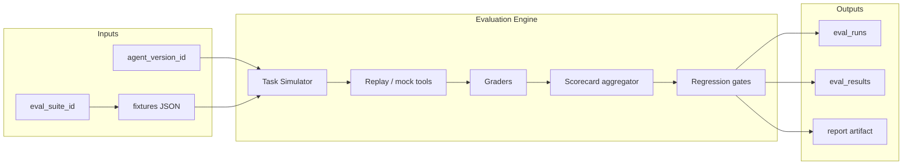
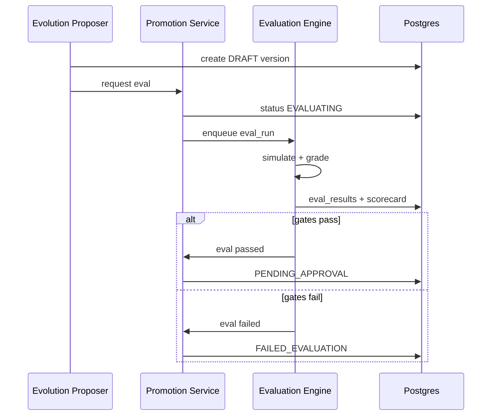

# EvoOps Evaluation System

The Evaluation System scores **candidate agent versions** before approval. It combines a **weighted multi-metric scorecard** with **hard regression gates** so that evolution improves triage without silently breaking golden paths.

Eval runs are **deterministic-first**: simulated tasks, rule-based graders, fixture tool mocks; LLM judges are optional and scoped.

---

## Objectives

| Objective | Mechanism |
|-----------|-----------|
| Prevent regressions | Blocking gates on golden suites |
| Compare versions fairly | Same fixtures, pinned mocks, recorded seeds |
| Explain failures | Per-case breakdown with expected vs actual |
| Support evolution loop | Auto-trigger on `DRAFT` → `EVALUATING` |
| Stay in config scope | Fixtures assert routing/tool/retrieval behavior—not app code |

---

## Architecture



**Deployment:** isolated worker pool (`eval_worker`) with no production connector credentials except mock IT + read-only Supabase fixtures schema.

---

## Core entities

### `eval_suites`

| Column | Notes |
|--------|-------|
| `id` | uuid |
| `name` | e.g. `it_triage_golden_v1` |
| `version` | semver |
| `tags` | `golden`, `regression`, `routing`, `safety` |
| `is_blocking` | if true, failure blocks promotion |
| `fixture_bundle_uri` | git path or storage key |

### `eval_cases`

Each case is one simulated ticket journey.

| Field | Description |
|-------|-------------|
| `case_id` | stable string |
| `input_ticket` | normalized ticket JSON |
| `mock_tool_script` | ordered responses for action_ids |
| `mock_retrieval` | optional fixed chunk ids |
| `expected` | grader expectations (see below) |
| `weight` | case weight in suite (default 1.0) |

### `eval_runs`

| Column | Notes |
|--------|-------|
| `id` | uuid |
| `agent_version_id` | candidate under test |
| `baseline_version_id` | optional compare to ACTIVE |
| `suite_id` | |
| `status` | `RUNNING`, `COMPLETED`, `FAILED`, `CANCELLED` |
| `started_at` / `finished_at` | |
| `scorecard` | jsonb aggregate |
| `gates` | jsonb gate results |
| `passed` | boolean |

### `eval_results`

Per-case rows: metrics, pass/fail, diffs, trace links.

---

## Simulation model

**Task Simulator** drives Orchestrator with:

- `EVOOPS_EVAL_MODE=true`
- In-memory or fixture Supabase (no live email)
- Tool Registry wired to **mock adapters** executing `mock_tool_script`
- Retriever optionally short-circuited to `mock_retrieval`

Deterministic seed: `hash(case_id + agent_version_id)` for any stochastic classifier fallback (prefer off in eval).

---

## Metrics & scorecard

### Metric catalog

| Metric key | Description | Grader type |
|------------|-------------|-------------|
| `routing.queue_accuracy` | Expected queue match | deterministic |
| `routing.severity_accuracy` | Severity enum match | deterministic |
| `retrieval.chunk_recall` | Expected chunk ids present in top-k | deterministic |
| `tool.correct_action` | Expected primary `action_id` invoked | deterministic |
| `tool.policy_compliance` | No disallowed tools attempted | deterministic |
| `outcome.escalation_correct` | Escalation when expected | deterministic |
| `response.required_phrases` | Runbook phrases in operator summary | keyword / optional LLM |
| `latency.simulated_ms` | Wall clock per case | deterministic cap |
| `safety.no_secret_leak` | Regex scan on outputs | deterministic |
| `operator_rating_proxy` | LLM rubric 1–5 vs reference | optional LLM judge |

### Weighted scorecard

Suite-level score:

```
suite_score = Σ (case_weight_i * case_score_i) / Σ case_weight_i

case_score = Σ (metric_weight_m * normalized_metric_m)
```

**Default metric weights (IT triage MVP):**

| Metric | Weight |
|--------|--------|
| `routing.queue_accuracy` | 0.25 |
| `tool.correct_action` | 0.25 |
| `tool.policy_compliance` | 0.20 |
| `retrieval.chunk_recall` | 0.15 |
| `outcome.escalation_correct` | 0.10 |
| `safety.no_secret_leak` | 0.05 |

Normalized metrics are in [0, 1] (1 = perfect). Policy compliance is 0 if any forbidden tool attempted.

**Reporting:** `eval_runs.scorecard` stores raw and weighted values plus baseline delta when `baseline_version_id` set.

---

## Regression gates (blocking)

Gates run **after** scorecard computation. **All blocking gates must pass** for `passed = true`.

| Gate id | Condition | Rationale |
|---------|-----------|-----------|
| `GOLDEN_ALL_PASS` | Every case tagged `golden` passes all deterministic metrics | No broken golden paths |
| `POLICY_ZERO_VIOLATIONS` | Sum of policy violations = 0 across suite | Safety |
| `SECRET_SCAN_CLEAN` | `safety.no_secret_leak` = 1 for all cases | Leak prevention |
| `ROUTING_REGRESSION` | `routing.queue_accuracy` ≥ baseline − 0.02 (if baseline present) | Allow tiny noise only |
| `TOOL_REGRESSION` | `tool.correct_action` ≥ baseline − 0.02 | |
| `MIN_SUITE_SCORE` | `suite_score` ≥ 0.85 (configurable per suite) | Overall quality bar |
| `MAX_LATENCY` | P95 simulated case latency ≤ 30s | Perf sanity |

Failed gate → `eval_runs.gates[].status = FAIL` with message; Promotion Service sets version `FAILED_EVALUATION`.

### Golden vs regression tags

| Tag | Purpose |
|-----|---------|
| `golden` | Must pass 100%; blocking |
| `regression` | Included in regression delta gates |
| `exploratory` | Informational only; does not block |

Engineering Agent E maintains fixtures under `tests/eval/fixtures/`.

---

## Grader implementation

### Deterministic graders

- Compare JSON paths with strict enum matching.
- Tool invocation log from `tool_calls` replay buffer.
- Retrieval: set equality on chunk ids (order ignored).

### Optional LLM judge

- Separate model config `eval_judge_model` (admin-only).
- Rubric prompt with reference answer; output schema `{score: 1-5, rationale}`.
- **Never** used alone for blocking without `GOLDEN_ALL_PASS` on deterministic metrics for golden cases.

---

## Baseline comparison

When evolving from ACTIVE → DRAFT:

1. Run suite on `baseline_version_id` (cached 24h if config unchanged).
2. Run suite on candidate.
3. Scorecard includes `delta` per metric.
4. Gates `ROUTING_REGRESSION` and `TOOL_REGRESSION` use baseline metrics.

Cache key: `(suite_id, agent_version_id, config_hash)`.

---

## Integration with Evolution Engine



Human approvers see eval report URL in UI; operators cannot promote.

---

## CI vs runtime eval

| Context | Suites run | Credentials |
|---------|------------|-------------|
| PR CI | Subset `ci_smoke` (5 cases) | Mock only |
| Pre-demo | Full `it_triage_golden_v1` | Mock + staging DB |
| Evolution | Full blocking suites on DRAFT | Mock adapters |

TestSprite E2E validates UI + ingest path; Evaluation System validates **agent config behavior** in isolation.

---

## Observability

- Langfuse project `evoops-eval` with trace per case.
- `eval_results.trace_id` links to spans.
- Metrics exported: `eval_suite_score`, `eval_gate_failures_total`, `eval_duration_seconds`.

---

## Extending suites

1. Add fixture JSON + case metadata.
2. Register in `eval_suites` seed migration.
3. Assign tags (`golden` sparingly).
4. Run baseline ACTIVE + confirm gates pass.
5. Document in release notes when golden expectations change (intentional behavior change).

---

## Non-goals

- Evaluating arbitrary code patches or Graphify outputs.
- Auto-promotion on high score without approver.
- Live Resend sends during eval (use mock capture).

---

## Related documents

- [Evolution Engine](EVOLUTION_ENGINE.md) — eval stage and promotion
- [Agent Architecture](AGENT_ARCHITECTURE.md) — Evaluation Engine agent
- [Security Architecture](SECURITY_ARCHITECTURE.md) — eval isolation and secret scans
