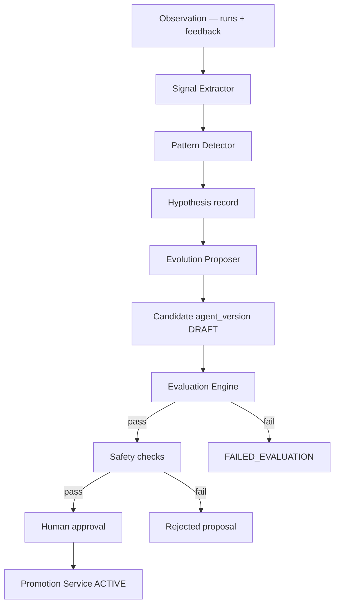
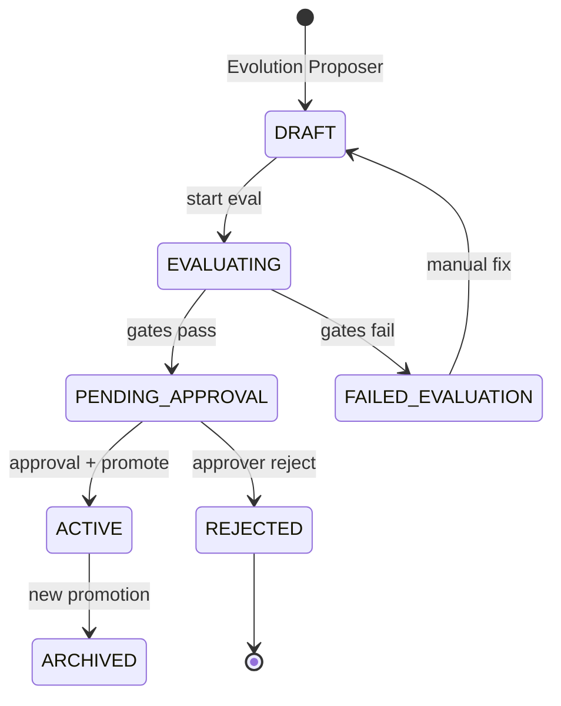

# EvoOps Evolution Engine

The Evolution Engine closes the loop from **observed operations** to **controlled config improvement**. It never deploys arbitrary application source changes; it produces and validates new **`agent_version`** records whose JSON config differs from the active version in approved dimensions only.

**Pipeline:** Observation → Signal → Pattern → Hypothesis → Candidate → Eval → Safety → Approval → Promotion.

---

## Scope of evolution (allowed config targets)

| Config key | Evolvable? | Notes |
|------------|------------|-------|
| `prompts.*` | Yes | Text only; max size limits; injection lint |
| `routing.rules`, `default_queue`, `playbook_id` | Yes | Must reference known playbooks/queues |
| `tool_policy.allow/deny/require_approval` | Yes | Cannot add unknown `action_id`s |
| `retrieval.*` | Yes | Bounded numeric ranges |
| `classifier.mode`, `llm_fallback` | Yes | Cannot enable unapproved models |
| Connector credentials, RLS, scopes | **No** | Admin + Security only |
| Semantic chunk content | **No** | Admin ingest path |
| Application source (`apps/*`) | **No** | Engineering agents outside runtime promotion |

Promotion Service rejects diffs touching forbidden paths (schema validator with JSON Pointer denylist).

---

## End-to-end flow



---

## Stage definitions

### 1. Observation

**Sources:** `task_runs`, `run_events`, `tool_calls`, `feedback`, Langfuse exports (optional batch).

**Granularity:** One observation bundle per terminal run (`SUCCEEDED`, `FAILED`, `ESCALATED`).

**Storage:** Observations are not a separate table in MVP—they are materialized views or Signal Extractor reads directly from run tables.

---

### 2. Signal

**Owner:** Signal Extractor (deterministic, optional LLM digest off by default).

**Signal types:**

| `signal_type` | Example payload |
|---------------|-----------------|
| `classification_mismatch` | expected vs actual queue from feedback correction |
| `tool_denied` | policy reason code |
| `retrieval_miss` | low max score / empty result set |
| `tool_success` | action_id + latency bucket |
| `escalation` | reason enum |
| `operator_rating` | -1/0/1 |

**Table:** `signals`

| Column | Notes |
|--------|-------|
| `id` | uuid |
| `task_run_id` | |
| `signal_type` | enum |
| `payload` | jsonb |
| `weight` | numeric default 1.0 |
| `created_at` | |

**Idempotency:** Unique `(task_run_id, signal_type, payload_hash)`.

---

### 3. Pattern

**Owner:** Pattern Detector (deterministic).

Detects motifs over window `W` (default 7 days) with minimum support `N` (default 5).

**Table:** `patterns`

| Column | Notes |
|--------|-------|
| `id` | uuid |
| `pattern_type` | e.g. `recurring_wrong_queue`, `retrieval_underperform` |
| `status` | `CANDIDATE` → `CONFIRMED` → `RESOLVED` / `DISMISSED` |
| `support_count` | |
| `confidence` | 0–1 from rule scoring |
| `exemplar_run_ids` | uuid[] |
| `facet` | `routing` / `retrieval` / `tool_policy` / `prompts` |
| `metadata` | jsonb |

**Confirmation rules (examples):**

- `recurring_wrong_queue`: ≥5 corrections to same target queue for source queue Q.
- `retrieval_underperform`: ≥8 runs with `retrieval_miss` and rating ≤ 0 in same playbook.

---

### 4. Hypothesis

Logical link between pattern and proposed config change—not necessarily persisted separately in MVP; stored on `evolution_proposals.hypothesis` text + structured `rationale` jsonb.

**Fields:**

```json
{
  "pattern_id": "uuid",
  "facet": "routing",
  "claim": "Tickets tagged 'vpn' should route to network queue",
  "expected_metric_delta": { "wrong_queue_rate": -0.15 },
  "risk_notes": "May increase escalations if playbook incomplete"
}
```

---

### 5. Candidate (Evolution Proposer)

**Owner:** Evolution Proposer (LLM-assisted draft + deterministic validator).

**Input:** `CONFIRMED` pattern, active config, template library for facet.

**Output:**

1. `evolution_proposals` row
2. New `agent_versions` row: `status = DRAFT`, `parent_version_id = active`
3. `agent_version_config` JSON patch (RFC 6902) stored as `config_diff` + full snapshot

**LLM constraints:**

- Output must validate against `EvolutionProposalSchema`.
- Max 3 routing rule additions per proposal; max 500 chars per prompt delta.
- Proposer suggests; **merge validator** applies patch and runs JSON Schema on result.

**Concurrency:** At most one open `DRAFT` per facet per org; second proposal queues or merges.

---

### 6. Eval

**Owner:** Evaluation Engine (see [Evaluation System](EVALUATION_SYSTEM.md)).

On proposal creation or manual trigger:

1. Promotion Service transitions version `DRAFT` → `EVALUATING`.
2. Eval runs pinned to candidate `agent_version_id`.
3. On gate pass → `PENDING_APPROVAL`; on fail → `FAILED_EVALUATION` with report link.

Evolution does not skip eval for any auto-generated proposal.

---

### 7. Safety

Deterministic checks after eval pass, before approval queue:

| Check | Action on fail |
|-------|----------------|
| Schema validation on full config | Reject proposal |
| Denylist paths (credentials, scopes) | Reject |
| Prompt injection heuristics (Agent L rules) | Reject or strip |
| Tool policy monotonicity option | Admin flag: deny if new allows expand risk_class |
| Retrieval bounds | Clamp or reject |
| Diff size limits | Reject |

**Table:** `evolution_proposals.safety_report` jsonb with check list.

---

### 8. Approval

**Roles:** `approver` or `admin` (operators cannot approve).

**Table:** `approvals`

| Column | Notes |
|--------|-------|
| `id` | uuid |
| `agent_version_id` | candidate |
| `approver_id` | |
| `decision` | `APPROVED` / `REJECTED` |
| `comment` | required on reject |
| `created_at` | |

UI shows: diff viewer, eval scorecard, safety report, exemplar runs.

---

### 9. Promotion

**Owner:** Promotion Service (deterministic, transactional).

**Transaction steps:**

1. Lock active version row.
2. Set prior `ACTIVE` → `ARCHIVED` (keep rollback pointer).
3. Set candidate → `ACTIVE` with `activated_at`.
4. Insert `audit_log` event `agent_version.promoted`.
5. Invalidate Tool Registry + Retriever caches.

**Rollback:** Reactivate previous `ARCHIVED` version in one transaction; no re-eval required if within `rollback_window_hours` (default 72) and config unchanged.

---

## Agent version state machine



---

## Tables (evolution-specific)

| Table | Role |
|-------|------|
| `agent_versions` | Version metadata, status, lineage |
| `agent_version_config` | Full JSON config snapshot per version |
| `evolution_proposals` | Links pattern, diff, hypothesis, safety |
| `signals`, `patterns` | Upstream learning |
| `eval_runs`, `eval_results` | Quality gate |
| `approvals`, `audit_log` | Governance |

---

## Scheduling & triggers

| Trigger | Action |
|---------|--------|
| Hourly cron | Pattern Detector on new signals |
| Pattern `CONFIRMED` | Enqueue Evolution Proposer job |
| Manual admin | Force proposal from pattern |
| Eval webhook complete | Promotion Service state transition |

**Backpressure:** Max 2 LLM proposer calls/hour in demo; burst queue otherwise.

---

## Metrics (product)

| Metric | Use |
|--------|-----|
| `wrong_queue_rate` | Routing proposals |
| `retrieval_miss_rate` | Retrieval tuning |
| `policy_denied_rate` | Tool policy |
| `mean_operator_rating` | Overall health |
| `escalation_rate` | Safety monitor |

Hypothesis should cite baseline and target deltas from last 7d dashboard.

---

## Failure handling

| Scenario | Handling |
|----------|----------|
| Eval flake | Retry once; then `FAILED_EVALUATION` |
| Approver timeout | Stays `PENDING_APPROVAL`; no auto-promote |
| Active version bug | Rollback via Promotion Service |
| Bad pattern | Mark `DISMISSED`; no proposer run |

---

## Demo narrative alignment

Brian demo stages map directly: Observed (runs) → Learned (signals/patterns) → Proposed (DRAFT) → Tested (eval) → Improved (ACTIVE).

---

## Related documents

- [Agent Architecture](AGENT_ARCHITECTURE.md) — Signal Extractor, Pattern Detector, Evolution Proposer, Promotion Service
- [Evaluation System](EVALUATION_SYSTEM.md) — gates and scorecards
- [Security Architecture](SECURITY_ARCHITECTURE.md) — approval and forbidden mutations
