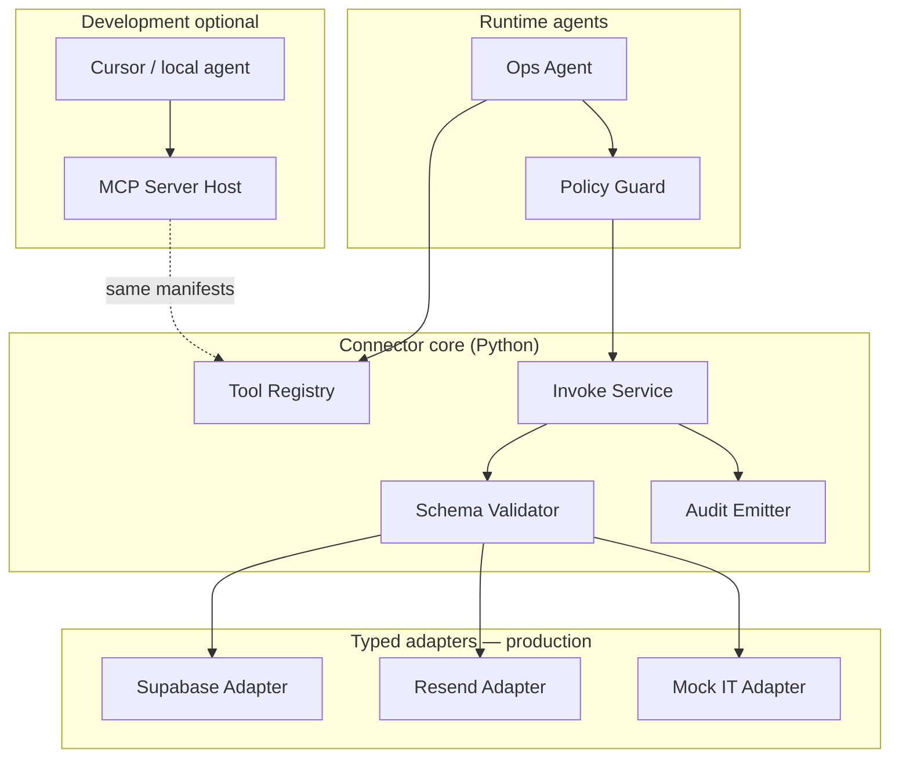
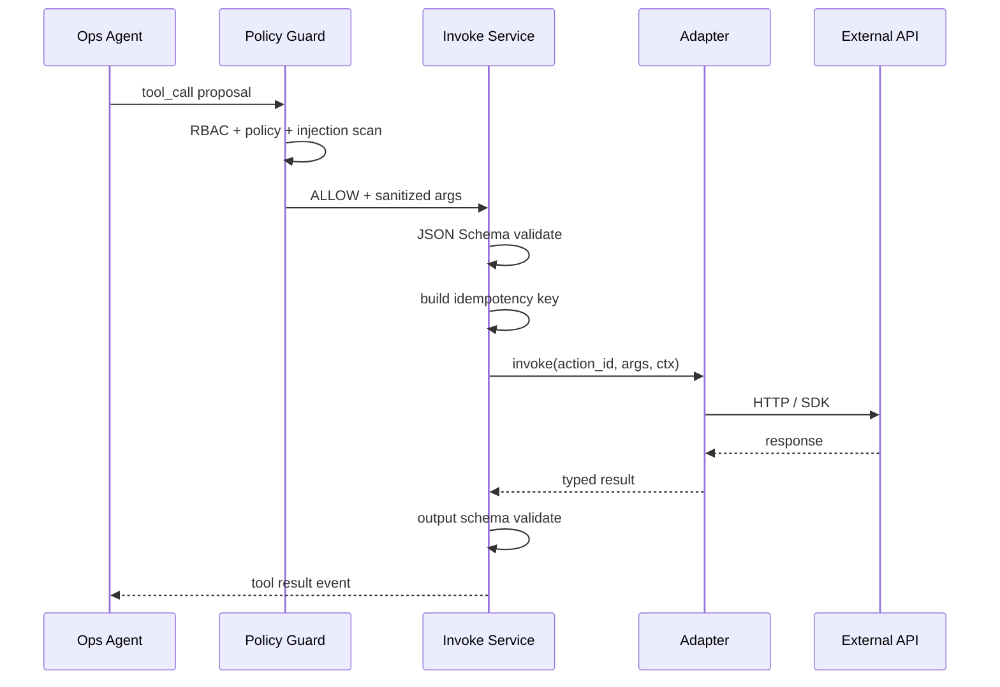

# EvoOps MCP & Connector Architecture

EvoOps treats **connectors** as the stable integration boundary between agents and the outside world (Supabase, Resend, mock IT systems, future Slack/ServiceNow). **Model Context Protocol (MCP)** is a **development and operator tooling** surface—not the production hot path for ticket triage. Production uses **typed Python adapters** with identical authorization, auditing, and argument validation as MCP wrappers used in dev.

**MVP connectors:** Supabase (data + auth context), Resend (email notify), mock IT job (synthetic ticket source / status updates).

---

## Goals

| Goal | Mechanism |
|------|-----------|
| One contract, two hosts | Shared `ConnectorManifest` → Python adapter (prod) + MCP tool defs (dev) |
| Fail closed | Policy Guard before invoke; scopes fixed at manifest level |
| Auditable | Every invoke writes `tool_calls` + `audit_log` with redacted args |
| Swappable backends | Registry resolves `action_id` → adapter method; no agent imports vendor SDKs |
| No scope escalation by LLM | Ops Agent selects among registered actions only; cannot invent endpoints |

---

## Layered architecture



**Rule:** MCP servers call the **same** `InvokeService` entrypoint as FastAPI workers. No duplicate business logic in MCP-only code paths.

---

## Connector manifest

Manifests live in repo (e.g. `connectors/manifests/*.yaml`), loaded into Postgres `connectors` / `connector_actions` for runtime enablement.

```yaml
id: resend
version: "1.0.0"
display_name: Resend Email
auth:
  type: server_secret          # RESEND_API_KEY in worker env — never in agent config
  env_var: RESEND_API_KEY
actions:
  - id: resend.send_ops_email
    display_name: Send operator notification
    risk_class: notify
    required_scopes: [tool:notify:email]
    idempotency_key_fields: [task_run_id, template_id]
    input_schema:
      type: object
      required: [to, subject, body_text]
      properties:
        to: { type: string, format: email }
        subject: { type: string, maxLength: 200 }
        body_text: { type: string, maxLength: 8000 }
    output_schema:
      type: object
      properties:
        message_id: { type: string }
```

### Manifest fields (required)

| Field | Purpose |
|-------|---------|
| `id` / `version` | Registry key; semver for breaking schema changes |
| `actions[].id` | Global `action_id` referenced in tool policy |
| `risk_class` | Drives Policy Guard defaults (`read`, `notify`, `write`, `destructive`) |
| `required_scopes` | RBAC tokens; see Security Architecture |
| `input_schema` / `output_schema` | JSON Schema draft 2020-12; validated pre/post invoke |
| `idempotency_key_fields` | Dedup retries at connector layer |

---

## MVP connector catalog

| Connector | Actions (examples) | Auth | Production adapter | MCP in dev |
|-----------|-------------------|------|--------------------|------------|
| **supabase** | `supabase.query_read`, `supabase.upsert_task_note` | Service role in worker; RLS bypass only inside adapter with explicit row filters | Yes | Yes (read-only sandbox project) |
| **resend** | `resend.send_ops_email` | API key server-side | Yes | Yes (test mode / restricted domain) |
| **mock_it** | `mock_it.fetch_queue`, `mock_it.update_ticket_status`, `mock_it.inject_demo_ticket` | Shared HMAC for webhook + API key for worker | Yes | Yes |

### Supabase adapter boundaries

- **Allowed:** parameterized queries against views exposed for ops (`tasks`, `task_runs`, `run_events` summaries), inserting operator notes into approved tables.
- **Forbidden:** arbitrary SQL from LLM; DDL; reading `auth.users` secrets; disabling RLS.
- Adapter methods map 1:1 to manifest actions with fixed SQL templates or Supabase RPC names.

### Resend adapter boundaries

- Fixed from-address from env; `to` must belong to org allowlist domain table.
- HTML optional; plain text required for audit readability.
- No attachments in MVP.

### Mock IT adapter boundaries

- Simulates external ITSM for demo: queues, statuses, synthetic latency.
- `inject_demo_ticket` admin-only scope; used for Brian demo resets.
- Idempotent status updates keyed by `(external_ticket_id, target_status)`.

---

## Invoke pipeline (production)



### Context object (`InvokeContext`)

| Field | Source |
|-------|--------|
| `org_id` | Single org constant in MVP |
| `task_run_id` | Orchestrator |
| `operator_id` | Supabase JWT subject (nullable for system) |
| `agent_version_id` | Active or eval-pinned version |
| `correlation_id` | UUID v4 per invoke |
| `roles[]` | `operator` / `approver` / `admin` |

Adapters must log `correlation_id` on every external request header (`X-EvoOps-Request-Id`).

---

## MCP development architecture

MCP exposes **read-mostly** and **sandbox** tools for builders. Tool names mirror `action_id` with namespace prefix:

```
evoops.mock_it.fetch_queue
evoops.supabase.query_read
evoops.resend.send_ops_email   # disabled unless MCP_ENABLE_WRITE=true
```

### MCP server layout (planned)

```
connectors/
  manifests/
  python/
    evoops_connectors/
      invoke_service.py
      adapters/
  mcp/
    server.py              # FastMCP or official SDK host
    tool_registration.py   # generated from manifests
```

**Generation:** Engineering Agent F reads manifests and emits MCP tool registration + Pydantic models. Drift fails CI if manifest changes without regen.

### When to use MCP vs API

| Use MCP | Use production API / workers |
|---------|------------------------------|
| Local debugging of connector args | Ticket triage under load |
| Cursor agent exploring mock IT data | Policy Guard enforced invokes |
| Prototyping new manifest action | Audited `tool_calls` persistence |
| Dry-run schema validation | Resend production send |

---

## Authorization parity matrix (MCP vs prod)

| Check | Production InvokeService | MCP server |
|-------|-------------------------|------------|
| JSON Schema validation | Yes | Yes |
| Policy Guard rules | Yes | Yes (same bundle) |
| RBAC scopes | JWT roles | MCP session token mapped to dev role |
| Audit log | Postgres | Postgres (same table, `source=mcp_dev`) |
| Rate limits | Per action | Stricter defaults |
| Write actions | Per tool policy | Env gate `MCP_ENABLE_WRITE` |

MCP sessions **never** receive service-role Supabase keys in tool responses. Adapters use server-side secrets only.

---

## Error model

Unified `ConnectorError` envelope:

```json
{
  "code": "POLICY_DENIED | VALIDATION_ERROR | RATE_LIMIT | UPSTREAM_ERROR | TIMEOUT",
  "message": "human-safe summary",
  "retryable": false,
  "correlation_id": "uuid"
}
```

| Code | Ops Agent behavior |
|------|-------------------|
| `POLICY_DENIED` | Explain to operator; do not retry |
| `VALIDATION_ERROR` | Fix args once if LLM self-correction enabled; else escalate |
| `RATE_LIMIT` | Backoff once |
| `UPSTREAM_ERROR` / `TIMEOUT` | Mark tool `AMBIGUOUS`; Orchestrator may surface retry to human |

Aligns with at-most-once discipline for write actions: ambiguous writes require human reconcile against mock IT / Supabase state.

---

## Configuration & enablement

`org_connector_settings` (single row in MVP):

| Column | Meaning |
|--------|---------|
| `connector_id` | Manifest id |
| `enabled` | Kill switch |
| `config_json` | Non-secret knobs (queue names, allowlist ids) |
| `encrypted_secrets_ref` | Pointer to vault/env—not stored in DB for MVP |

Tool Registry merges manifest + org settings at load time; cached with TTL 60s invalidated on Promotion Service activate.

---

## Testing strategy

| Layer | Tests |
|-------|-------|
| Manifest | JSON Schema meta-validation, scope lint (Agent L) |
| Adapter | Unit tests with recorded HTTP fixtures |
| Invoke Service | Policy + idempotency integration tests |
| MCP | Smoke test registering tools; optional live test against mock IT |
| E2E | TestSprite path: ingest → triage → mock IT status update |

---

## Adding a new connector (checklist)

1. Author manifest with schemas, scopes, risk class.
2. Implement Python adapter methods (no LLM calls inside adapter).
3. Register in Tool Registry loader; add org enablement default `false`.
4. Extend Policy Guard default bundle with explicit allow rules.
5. Generate MCP tools (Agent F) and document in operator runbook.
6. Add eval scenarios (Agent E) covering happy path + denial path.
7. Security review: Security Architecture matrix row + approval requirements.

---

## Non-goals

- MCP as the only integration path in production.
- Per-operator arbitrary SQL or shell MCP tools.
- LLM-chosen HTTP URLs (only registered `action_id`s).
- Storing third-party API keys in `agent_version_config`.

---

## Related documents

- [Agent Architecture](AGENT_ARCHITECTURE.md) — Tool Registry, Policy Guard, Ops Agent
- [Security Architecture](SECURITY_ARCHITECTURE.md) — tool authz matrix
- [Memory Architecture](MEMORY_ARCHITECTURE.md) — what Supabase adapter may read/write
