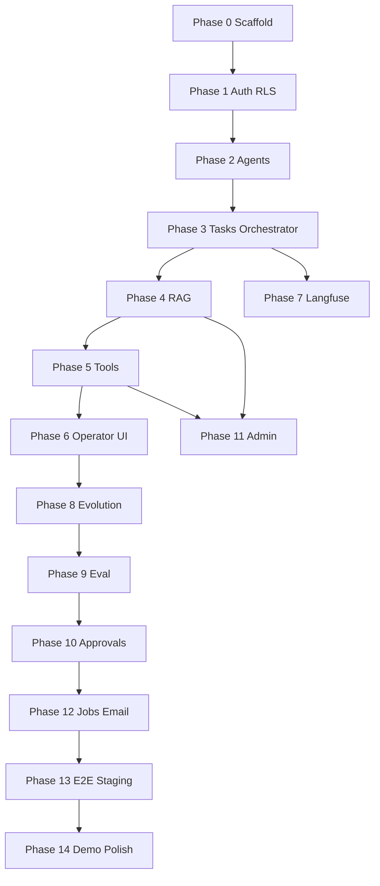

# EvoOps — Master Roadmap (Phases 0–14)

**Horizon:** From empty repo to Brian-demo-ready self-evolving IT triage  
**Tenancy:** Single org · **Evolution:** agent version config only

Use [PROJECT_STATUS.md](PROJECT_STATUS.md) for current completion. Each phase lists **outcomes**, **deliverables**, and **exit criteria**.

---

## Phase 0 — Monorepo scaffold & dev ergonomics

**Goal:** A cloneable repo that installs, lints, and deploys empty shells.

**Deliverables**

- `apps/web`: Next.js + TypeScript + Tailwind, App Router, health page
- `apps/api`: FastAPI project layout, `/health`, OpenAPI stub
- Root tooling: workspace scripts (pnpm/npm), Python venv/poetry or uv, `.env.example`
- `supabase/` CLI config; link to dev project
- CI skeleton: lint + typecheck (web + api); no secrets in repo
- README and docs cross-links verified

**Exit criteria**

- Local web and API start; CI green on default branch
- First authorized push to [EvoOpsEGG](https://github.com/PawishrajhenAR/EvoOpsEGG.git) completed
- PROJECT_STATUS updated to “Phase 0 complete”

---

## Phase 1 — Auth, profiles, roles, RLS foundation

**Goal:** Secure single-org identity layer.

**Deliverables**

- Migrations: `profiles`, `roles`, `user_roles`, seed roles
- Supabase Auth integration in web (login/logout/session)
- API JWT validation middleware; role dependency helpers
- Baseline RLS policies (operators read tasks; admin manages roles)
- Admin UI stub: assign roles

**Exit criteria**

- Three test users (`operator`, `approver`, `admin`) behave per role in API tests
- No anonymous access to application tables

---

## Phase 2 — Agent definitions & version config

**Goal:** Store and display agent version config without running agents yet.

**Deliverables**

- Migrations: `agent_definitions`, `agent_versions` + status enum/check
- CRUD API for definitions; create/list versions
- State machine service (valid transitions only)
- Web: agent list, version detail, JSON config editor (admin)

**Exit criteria**

- Can create DRAFT version with sample triage config JSON
- Invalid transitions rejected with clear errors

---

## Phase 3 — Tasks, runs, orchestrator MVP

**Goal:** Run a **fixed-script** or minimal LLM classify step against a task using ACTIVE version.

**Deliverables**

- Migrations: `tasks`, `task_runs`, `run_events`, `tool_calls` (stub)
- POST start run → orchestrator pipeline skeleton
- Langfuse trace id placeholder on runs
- Web: create manual task, start run, event timeline

**Exit criteria**

- End-to-end manual task → run → completed with events persisted
- Run binds to `agent_version_id` at start

---

## Phase 4 — Knowledge ingest & pgvector RAG

**Goal:** Ops runbooks searchable; retrieval step in orchestrator.

**Deliverables**

- Migrations: `knowledge_documents`, `knowledge_chunks`, vector index
- Job: `embed_document` worker
- Admin upload UI; processing status
- Retrieval service integrated in orchestrator; `run_events` type `retrieval`

**Exit criteria**

- Upload sample runbook → query returns relevant chunks in run
- Graphify **not** used for this path (documented in runbook)

---

## Phase 5 — Connectors & tool execution

**Goal:** Policy-gated tool calls for triage demo tools.

**Deliverables**

- Migrations: `connectors`, `tool_policies`
- Tool executor with allow/deny and audit
- At least: HTTP mock connector + Resend stub or sandbox
- Orchestrator tool-choice step with logging

**Exit criteria**

- Denied tool returns `denied` in `tool_calls` without side effect
- Allowed tool records request/response redacted

---

## Phase 6 — Operator experience & feedback

**Goal:** Operators can work tickets and leave structured feedback.

**Deliverables**

- Migrations: `feedback`
- Inbox filters, task detail polish, feedback form (all feedback types)
- API aggregates feedback on task_run

**Exit criteria**

- Operator cannot approve versions; can submit all feedback types
- Feedback visible on task run detail

---

## Phase 7 — Langfuse observability

**Goal:** Production-debuggable LLM traces.

**Deliverables**

- Instrument orchestrator LLM calls (classify, plan)
- Web link from run → Langfuse trace
- Environment config docs for Langfuse keys

**Exit criteria**

- Each completed run has trace id; spans visible in Langfuse UI

---

## Phase 8 — Signals, patterns & evolution proposals

**Goal:** Close the loop from feedback to proposed config changes.

**Deliverables**

- Migrations: `signals`, `patterns`, `evolution_proposals`
- Jobs: aggregate signals; optional LLM proposal draft
- Apply proposal → new DRAFT `agent_version` with `parent_version_id`
- Admin/evolution UI: list patterns, proposals, diff preview

**Exit criteria**

- Synthetic feedback generates at least one proposal + DRAFT version
- No mutation of ACTIVE version without later phases

---

## Phase 9 — Eval suites & gating

**Goal:** Objective gate before human approval.

**Deliverables**

- Migrations: `eval_suites`, `eval_cases`, `eval_runs`, `eval_results`
- Eval runner job; transitions `EVALUATING` → `PASSED` / `FAILED_EVALUATION`
- Seed suite `it-triage-golden` with 5+ cases
- Web: trigger eval, view results

**Exit criteria**

- Failing case blocks PASSED status
- Passing suite moves version to PASSED / PENDING_APPROVAL per product rules

---

## Phase 10 — Approvals, promotion & rollback

**Goal:** Governed activation of new agent versions.

**Deliverables**

- Migrations: `approvals`, `audit_log`
- Approve/reject API; atomic ACTIVE swap; ROLLED_BACK handling
- Approver UI queue with config diff vs current ACTIVE

**Exit criteria**

- Promotion creates audit entries; only one ACTIVE per agent
- Rollback restores prior version as ACTIVE with audit trail

---

## Phase 11 — Admin console completion

**Goal:** Full platform configuration without developer intervention.

**Deliverables**

- Connectors CRUD, tool policy editor
- Knowledge management (re-ingest, archive)
- Eval suite/case editor
- User role admin hardened

**Exit criteria**

- Admin can configure demo end-to-end without SQL

---

## Phase 12 — Notifications & job hardening

**Goal:** Reliable async work and notify step in triage flow.

**Deliverables**

- Migrations: `jobs` (if not earlier), indexes
- Worker retry/backoff; dead-letter visibility
- Resend integration for operator/customer notify tool
- Orchestrator notify branch in demo vertical

**Exit criteria**

- Email send logged; failures retry then surface in admin

---

## Phase 13 — TestSprite E2E & staging pipeline

**Goal:** Regression safety before human-approved pushes.

**Deliverables**

- Staging deploys: Vercel + Railway/Render + Supabase staging
- TestSprite flows: login, create task, run, feedback, approve (approver creds)
- CI or scheduled E2E; document push approval checklist

**Exit criteria**

- E2E green on staging; checklist linked from README
- Policy: post–Phase 0 pushes require human sign-off after tests

---

## Phase 14 — Brian demo readiness & narrative polish

**Goal:** Repeatable 10-minute stakeholder demo.

**Deliverables**

- Demo script: observed → learned → proposed → tested → improved
- Sample tickets, runbooks, and pre-seeded patterns for one “evolution cycle”
- Graphify documented for **engineering** onboarding only
- Performance pass on demo path; known issues doc
- Final PROJECT_STATUS and roadmap checkbox update

**Exit criteria**

- Two consecutive dry runs without manual DB edits
- All success criteria in [PRODUCT_SPEC.md](PRODUCT_SPEC.md) §11 addressed or explicitly waived with sign-off

---

## Phase dependency graph

---

## Cross-cutting concerns (all phases)

- **Security:** RLS review on every new table  
- **Audit:** Log promote, reject, policy change, connector enable/disable  
- **Docs:** Update DATA_MODEL when migrations diverge; keep ARCHITECTURE deployment table accurate  
- **Evolution boundary:** Reviews reject PRs that auto-modify app source from agent runs  

---

## Related documents

- [PROJECT_STATUS.md](PROJECT_STATUS.md) — Current phase tracker  
- [PRODUCT_SPEC.md](PRODUCT_SPEC.md) — Requirements  
- [ARCHITECTURE.md](ARCHITECTURE.md) — System design  
- [DATA_MODEL.md](DATA_MODEL.md) — Schema reference
